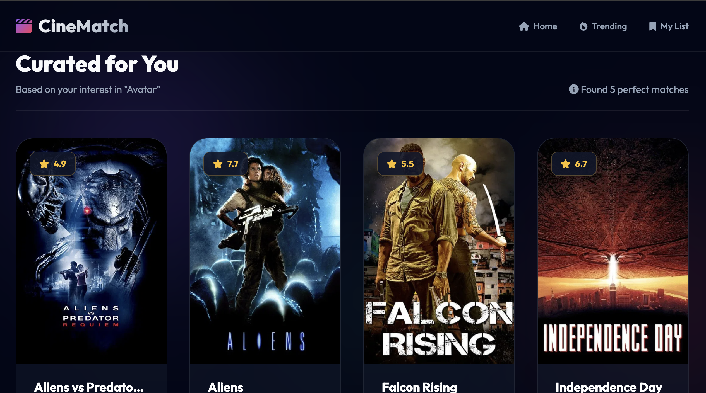

# 🎬 Movie Recommender System

### _Personalized Suggestions using Machine Learning & NLP_



## 📌 Project Overview

This is a comprehensive **Content-Based Movie Recommendation System** built using Python and Django. By analyzing movie metadata (genres, keywords, cast, and crew), the system calculates the similarity between films to provide accurate "Top 10" recommendations based on a user's interest.

---

## 🔄 Project Flow: From Data to Recommendation

The system follows a structured pipeline to transform raw movie information into a smart recommendation engine:

1.  **Data Collection**: Loads the **TMDB 5000 Movies Dataset**, merging movie details with credits (cast and crew).
2.  **Data Cleaning & Feature Engineering**:
    - Extracts relevant information from complex JSON formats (like Genres and Cast).
    - Combines "Overview", "Keywords", "Genres", "Cast", and "Crew" into a single **"Tags"** column.
3.  **Preprocessing (NLP)**:
    - **Stemming**: Reduces words to their root form (e.g., "loving", "loved" → "love") to improve matching.
    - **Tokenization**: Breaks down sentences into individual words.
4.  **Model Training**:
    - **Vectorization**: Converts the "Tags" text into numerical vectors using Bag-of-Words (CountVectorizer).
    - **Similarity Calculation**: Computes the **Cosine Similarity** between all 4,800+ movies to create a similarity matrix.
5.  **Deployment**: The trained matrix is serialized with **Pickle** and served via a **Django** web application.

---

## 🧠 Complex Terms Simplified

If you're new to Machine Learning, here are the core concepts explained simply:

### 1. Content-Based Filtering

Think of this as a "more of the same" strategy. If you like _Iron Man_, the system looks at its "content" (Action, Marvel, Robert Downey Jr.) and finds other movies with the most matching traits.

### 2. Vectorization (NLP)

Computers don't understand words; they understand numbers. **Vectorization** is the process of turning a movie's "Tags" into a list of numbers (a vector). Each number represents how often a specific word appears in that movie's profile.

### 3. Cosine Similarity

Imagine each movie is an arrow pointing in a specific direction in a giant multi-dimensional map. **Cosine Similarity** measures the _angle_ between these arrows.

- **Angle is 0 (Similarity 1)**: The movies are identical.
- **Angle is 90 (Similarity 0)**: The movies are completely different.

### 4. Pickle Serialization

Retraining the model every time a user visits the website would be slow. **Pickle** "freezes" the calculated similarity scores into a file so the website can load them instantly in under 200ms.

---

## 🛠️ Tech Stack

- **Language**: Python 3.10
- **Libraries**: Pandas, NumPy, Scikit-learn (Machine Learning), NLTK (Natural Language Processing)
- **Web Framework**: Django
- **Deployment**: Docker, Hugging Face Spaces / Render
- **Server**: Gunicorn & WhiteNoise

---

## 🚀 How to Run Locally

### Option A: Using Docker (Recommended)

```bash
# Build the image
docker build -t movie-recommender .

# Run the container
docker run -p 7860:7860 movie-recommender
```

_The app will be available at `http://localhost:7860`_

### Option B: Manual Setup

1.  **Create Environment**: `conda create -n movie python=3.10 -y`
2.  **Activate**: `conda activate movie`
3.  **Install Deps**: `pip install -r requirements.txt`
4.  **Run Server**:
    ```bash
    cd web_app
    python manage.py runserver
    ```

---

## 👨‍💻 Author

**Monu Manish**  
[GitHub](https://github.com/monudbg) | [LinkedIn](https://www.linkedin.com/in/monu-manish/)
